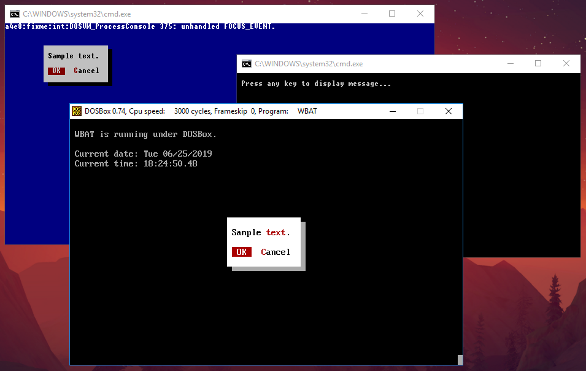

	<b>WBAT64 - <a href="https://www.youtube.com/watch?v=RYuUqMUcE0c">YouTube</a></b>
	 
	<i>WBAT.COM for 64-bit operating system.</i>
	   
	

# What is WBAT?
WBAT is a batch utility that builds dialog boxes with menus, buttons and input fields. No ANSI color codes needed, only color names. Runs under DOS 3.3 or better, or under any Windows, in a DOS box or full screen. [WBAT Website](https://www.horstmuc.de/ui.htm)

# How it works?
It emulates DOS in 64-bit Windows.
There are 2 version to choose:
* [DOSBOX](https://www.dosbox.com) - Very fast and all functions but creates new window and current path cannot contain any space.
* [OTVDM](https://github.com/otya128/winevdm) - Slow, limited functions and can't process output.

# Syntax for DOSBox method:
    WBAT64 "YOUR_CODE"
    
Example:

    WBAT64 "box (black on +white) :asd"
    
# Syntax for OTVDM method:
    otvdm.exe --app-name WBAT.COM wbat YOUR_CODE
    
Example:

    otvdm.exe --app-name WBAT.COM wbat cls ! box (black on white) :asd
    
If it's not working, try installing:
> OTVDM/wbat/install.reg

# WBAT settings
To edit colors, styles and other options edit **WBAT.INI** file.
For all documentation see **DEMO.BAT** after downloading [WBAT](https://www.horstmuc.de/ui.htm).
